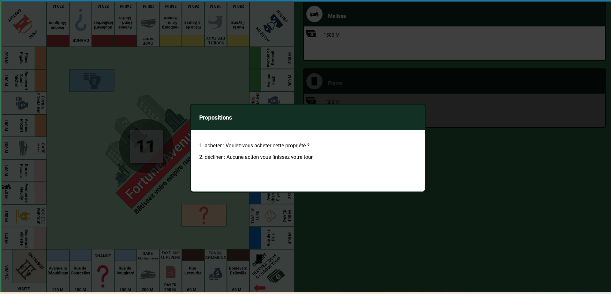
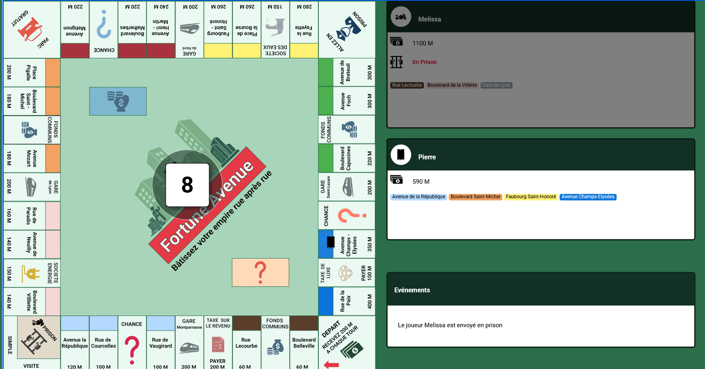

#  Fortune Avenue 

Jeu de plateau inspiré du Monopoly développé en **JavaScript**


## 1. Description du projet

**Fortune Avenue** est une version simplifiée du Monopoly codée en **vanilla JavaScript**

**L’objectif**: gérer vos propriétés, encaisser des loyers et rester le dernier joueur solvable

Ce projet vise à explorer :
- la **programmation orientée objet** en JavaScript 
- la **gestion des états de jeu** (tours, actions, événements aléatoires)
- et le **rendu graphique dynamique** via la **Canvas API**


## 2. Principales fonctionnalités 

- **Plateau de jeu** (structure du plateau : case dans un Json/array, gérer les types de cases comme Départ, Chance, Fonds communs, afficher le plateau)
- **Gestion des joueurs** (créer des joueurs, changer de tour, détection de la faillite, afficher un tableau de board)
- **Déplacement** (lancement des 2 dés, rejouer avec le double 6, déplacer un pion sur le plateau, gérer la case départ, mettre le pion sur le plateau)
- **Gérer les transactions** (achats, ventes, loyers, enchères, échanges, créer une banque, gérer la somme d'argent du joueur, ajouter des maisons...)
- **Cartes “Chance” et “Fonds Communs”** (piocher une carte aléatoire, Gagner ou perdre de l’argent, avancer ou reculer, aller en prison ou sortir de prison)
- **Gérer les cases** (taxes, prison..)
- **Gérer l'interface et l'expérience utilisateur** (Afficher le plateau, le tour du joueur courant, le solde, bouton “Lancer les dés”, “Acheter”, “Passer le tour”, )


## Aperçu 

<div style="display:flex; gap:1rem">
  
  
</div>

## 3. Installation 

```
  git clone https://github.com/Melissa-code/fortune_avenue.git
  cd fortune_avenue
  npm install
```

Ouvrir le fichier `index.html` dans le navigateur pour commencer à jouer

## 4. Tests 

Les tests unitaires sont écrits avec [Jest](https://jestjs.io/).

> **Note de compatibilité :** Le projet utilise les modules ECMAScript (ESM) 
natifs. 
Afin d'assurer la compatibilité des tests à la fois sur **macOS/Linux** et **Windows**, 
nous utilisons `cross-env` pour passer l'option `--experimental-vm-modules` à Node.js

### Prérequis/Installation

Si vous venez d'installer le projet ou si les dépendances de développement 
ne sont pas encore présentes :

```bash
npm install
```

Si vous ajoutez cross-env au projet pour la première fois, installez-le avec : 

```bash
npm install --save-dev cross-env
```

### Lancer les tests 

```bash
npm test
```

### Structure des tests

```
tests/
├── Carte.test.js
├── Effet.test.js
└── ...
```

## ESLinter et Prettier

### Lancer ESLint et Prettier

```bash
npx eslint js/model/Carte.js
npx eslint js/model/Carte.js --fix

npx prettier --write tests/Effet.test.js
```


## 5. Technologies utilisées

- **[HTML](https://developer.mozilla.org/fr/docs/Web/HTML)**: structure du jeu
- **[CSS](https://developer.mozilla.org/fr/docs/Web/CSS)**: design et mise en page
- **[JavaScript](https://developer.mozilla.org/fr/docs/Web/JavaScript)**: logique du jeu 
- **[Canvas API](https://developer.mozilla.org/en-US/docs/Web/API/Canvas_API)**: rendu du jeu
- **[Jest](https://archive.jestjs.io/docs/en/22.x/getting-started.html)**: tests unitaires
- **[ESLint](https://eslint.org/docs/latest/)**: analyse statique du code (erreurs/mauvaises pratiques)
- **[Prettier](https://prettier.io/docs/)**: formate indentation, largeur de ligne, style cohérent

### Outils

- **[Git](https://git-scm.com/docs/git)**: versioning du jeu
- **[Figma](https://help.figma.com/hc/fr)**: design du plateau et des cartes

### IDE 
- **[VSCODE](https://code.visualstudio.com/)**
 - Ajouter dans `settings.json` (`Ctrl`+`Shift`+`P` → "Open User Settings JSON") :
```json
    "editor.rulers": [80]
```

## 6. Contributions 

Les contributions, suggestions et issues sont les bienvenues.
N’hésitez pas à ouvrir une issue pour proposer une idée ou signaler un bug.


## 7. Author 

Melissa-code 


## 8. Licence 

Sous licence MIT 
© 2026 Fortune Avenue Project