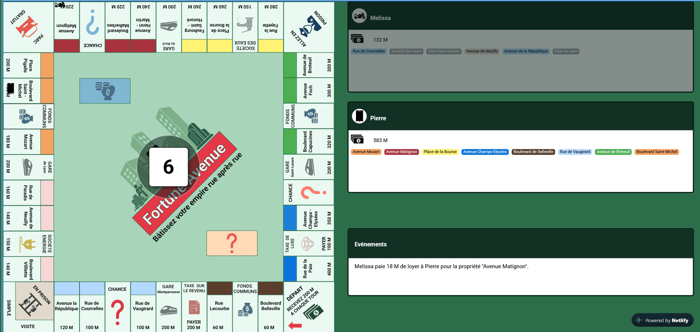
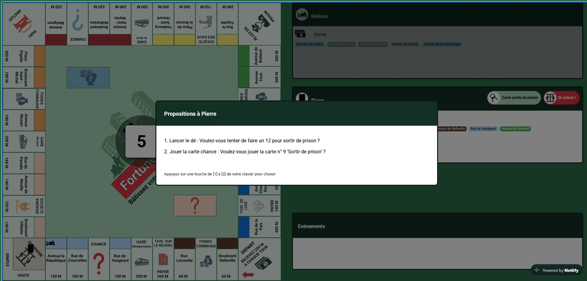
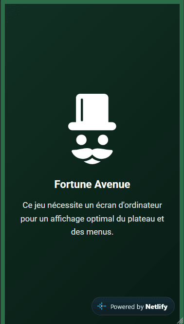

#  Fortune Avenue 

Jeu de plateau développé en **JavaScript**

<a href="https://fortuneavenue.netlify.app/">
  
</a>


## 1. Description du projet

Fortune Avenue est une version simplifiée du jeu Monopoly codée en **vanilla JavaScript**.

**L’objectif**: gérer ses propriétés, encaisser des loyers et rester le dernier joueur solvable. 

Ce projet met en application :

- **programmation orientée objet avancée (POO)** avec l'héritage, le polymorphisme, l'architecture modulaire,
- **gestion des états de jeu** avec les tours, les actions, les événements aléatoires,
- **rendu graphique dynamique** via la **Canvas API**,
- **qualité de code** via des tests unitaires automatisés avec **Jest**, une analyse statique (linter) et un pipeline CI/CD automatisé,
- **bonnes pratiques du Web** avec l'intégration SEO (`robots.txt`, `sitemap.xml`), le balisage Open Graph et l'accessibilité `.sr-only`
- **surveillance et monitoring des erreurs en production** via **Sentry** pour garantir la fiabilité du site
- **suivi d'audience éthique et respectueux de la vie privée** via **Simple Analytics** sans cookies

## 2. Principales fonctionnalités 

- **Plateau et modélisation des cases :**  
  structure de données modulaire (`Array` / `JSON`) gérant les différents types de cases (Départ, Propriétés, Chance, Fonds Communs, Taxes, Prison) via le polymorphisme et l'héritage

- **Moteur de jeu et déplacements :**  
  lancement des dés, calcul dynamique des déplacements, positionnement des pions sur le Canvas et gestion des règles spécifiques (bonus de passage sur la case Départ, gestion du tour de jeu)

- **Économie et transactions :**  
  module de banque, gestion du capital des joueurs, achat et vente de propriétés, calcul et encaissement des loyers, construction de maisons et détection automatique de la faillite

- **Cartes Événements (Chance et Fonds Communs) :**  
  tirage aléatoire générant des effets variés (gains ou pertes d'argent, déplacements forcés, envois ou sorties de prison)

- **Interface Utilisateur et expérience (UI/UX) :**  
  tableau de bord dynamique affichant le tour courant, le solde des joueurs et un plateau de jeu avec le dé

### Aperçu :

| Événements | Sortie de prison | Mobile |
| :---: | :---: | :---: |
|  |  |  |


⚠️ **Ce jeu est optimisé pour ordinateur** et nécessite l'utilisation des flèches du clavier. 
Il n'est pas compatible avec les appareils mobiles ou tablettes.


## 3. Installation 

```
  git clone https://github.com/Melissa-code/fortune_avenue.git
  cd fortune_avenue
  npm install
```

Ouvrir le fichier `index.html` dans le navigateur pour commencer à jouer


## 4. Tests 

Les tests sont écrits avec [Jest](https://jestjs.io/).

> **Note de compatibilité :** Le projet utilise les modules ECMAScript (ESM) natifs. 
Afin d'assurer la compatibilité des tests à la fois sur **macOS/Linux** et **Windows**, 
nous utilisons `cross-env` pour passer l'option `--experimental-vm-modules` à Node.js

### Prérequis/Installation

Si vous venez d'installer le projet ou si les dépendances de développement 
ne sont pas encore présentes :

```bash
npm install

# Pour ajouter `cross-env` au projet pour la première fois, l'installer avec 
npm install --save-dev cross-env
```

### Lancer les tests 

```bash
npm test 

# Lancer un fichier de test spécifique
npm test tests.View.test.js
```

### Structure des tests

```
tests/
├── Controller.test.js
├── Controller.integration.test.js
├── View.test.js
├── Carte.test.js
└── ...
```

#### Tests unitaires

Chaque classe est testée individuellement. Les dépendances (`Jeu`, `View`, `Controller`) sont mockées avec `jest.fn()` plutôt qu'instanciées réellement
via des fonctions utilitaires `creerJeu()`, `creerView()`, `creerJoueur()` en haut de chaque fichier de test. 
Cette approche isole chaque classe testée: un bug dans `Jeu` ne fait pas échouer les tests de `Controller` et inversement.

#### Tests d'intégration 

Le fichier `Controller.integration.test.js` valide le comportement global du contrôleur en faisant interagir les différents composants du jeu en conditions réelles.

> **Note :** `View.test.js` s'exécute dans l'environnement `jsdom` (configuré dans `package.json`, clé `"jest"`) 
car il manipule le DOM et le Canvas. Les autres fichiers utilisent l'environnement Node par défaut.


## 5. Qualité du code (ESLinter et Prettier)

Le projet utilise ESLint pour détecter les erreurs de code et Prettier pour uniformiser le formatage.

### Lancer ESLint et Prettier

```bash
# Vérifier le code avec ESLint
npm run lint

# Corriger automatiquement les erreurs ESLint réparables
npm run lint:fix

# Formater l'ensemble du code avec Prettier
npx prettier --write .

# Formater un fichier avec Prettier
npx prettier --write tests/Effet.test.js
```


## 6. Déploiement CI/CD 

Le projet utilise un pipeline de **CI/CD** automatisé via **GitHub Actions** 
et hébergé sur **Netlify**

### Processus de déploiement (Test-First)

1. **Analyse statique (Linter) :** le code est vérifié pour respecter les bonnes pratiques et éviter les erreurs de syntaxe
2. **Tests automatiques :** à chaque `push` ou `merge` sur la branche `main`, GitHub Actions exécute la suite de tests **Jest**
3. **Condition de déploiement :** seulement si tous les tests passent avec succès, le déploiement vers Netlify est déclenché automatiquement
4. **Sécurité :** aucun code défectueux ou avec des tests en échec ne peut atteindre la production

### Configuration requise 

Pour que le déploiement automatique fonctionne, les identifiants de connexion Netlify 
doivent être configurés dans les **Secrets GitHub** du dépôt (`Settings > Secrets and variables > Actions`)


## 7. Technologies utilisées

- **[HTML](https://developer.mozilla.org/fr/docs/Web/HTML)**: structure du jeu
- **[CSS](https://developer.mozilla.org/fr/docs/Web/CSS)**: design et mise en page
- **[JavaScript](https://developer.mozilla.org/fr/docs/Web/JavaScript)**: logique du jeu 
- **[Canvas API](https://developer.mozilla.org/en-US/docs/Web/API/Canvas_API)**: rendu du jeu
- **[Jest](https://archive.jestjs.io/docs/en/22.x/getting-started.html)**: tests unitaires et d'intégration
- **[ESLint](https://eslint.org/docs/latest/)**: analyse statique du code (erreurs/mauvaises pratiques)
- **[Prettier](https://prettier.io/docs/)**: formate indentation, largeur de ligne, style cohérent

### Outils

- **[Git](https://git-scm.com/docs/git)**: versioning du jeu
- **[Figma](https://help.figma.com/hc/fr)**: design du plateau et des cartes
- **[GitHub Actions](https://docs.github.com/fr/actions)**: CI CD 
- **[Netlify](https://docs.netlify.com/)**: serveur de production 
- **[Simple Analytics](https://dashboard.simpleanalytics.com/)**: suivi de trafic éthique respectueux de la vie privée (sans cookies ni bannières de consentement)
- **[Sentry](https://sentry.io/)**: suivi des erreurs en temps réel et monitoring de production


### IDE 
- **[VSCODE](https://code.visualstudio.com/)**
 - Ajouter dans `settings.json` (`Ctrl`+`Shift`+`P` → "Open User Settings JSON") :
```json
    "editor.rulers": [80]
```

## 8. Contributions 

Les contributions, suggestions et issues sont les bienvenues.
N’hésitez pas à ouvrir une issue pour proposer une idée ou signaler un bug.


## 9. Author

Melissa-code: création et développement du projet

## 10. Licence 

© 2026 Fortune Avenue Project (Melissa-code) 