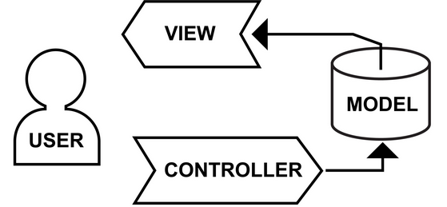
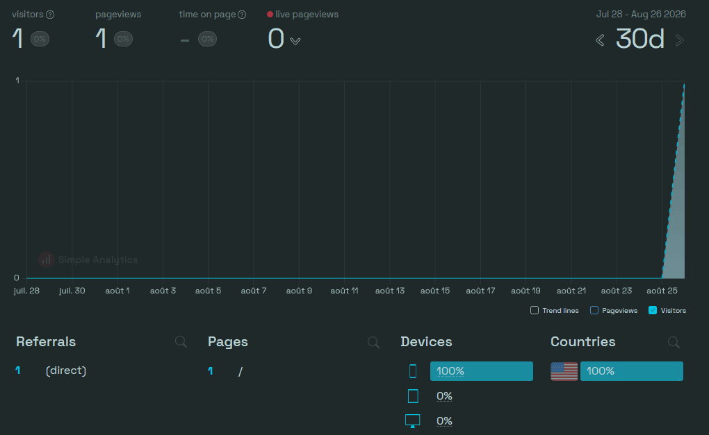

# Documentation Fortune Avenue

## Partie 1: Vue et Interface utilisateur

### 1. Architecture 

Le projet suit une architecture MVC (Model-View-Controller) pour assurer une séparation stricte des responsabilités:

- **Le Modèle** gère l'état du jeu (ex: valeur du dé, positions des joueurs)

- **Le Contrôleur** intercepte les événements (ex: clics) et fait le pont entre la donnée et l'image

- **La Vue** gère l'affichage sur un Canvas HTML et la détection spatiale des clics


<div style="display:flex; justify-content: center;">
    
</div>

---


### 2. Gestion des actifs (les images)

Pour optimiser les performances et la lisibilité, les ressources sont gérées de deux manières:

- **Centralisation**: les chemins d'accès aux images sont stockés dans des Enums (Objets gelés) pour éviter les erreurs de saisie.

```
// enum/ImagesResultatsDe
const ImagesResultatsDe = Object.freeze({
  UN: "./images/de/de_1.svg",
  DEUX: "./images/de/de_2.svg",
  ...
})
```

- **Pré-chargement**: au démarrage, la Vue instancie tous les objets Image() nécessaires. Cela garantit que les faces du dé et les pions s'affichent instantanément lors du premier rafraîchissement sans "clignotement" dû au téléchargement.

```
// View.js
chargerImagesResultatsDe() {
    for (const imageDe in ImagesResultatsDe) {
        const image = new Image();
        image.src = ImagesResultatsDe[imageDe];
        image.onload = () => this.refresh();
        this.imagesResultatsDe.push(image);
    }
}
```
---


### 3. Logique d'affichage dynamique

Le rendu graphique est piloté par une méthode centrale `refresh()` qui suit un ordre de couches (layers):

- **Arrière-plan**: le plateau de jeu `drawImage()`.

- **Calque de données**: les pions des joueurs positionnés suivant un calcul de coordonnées relatif à la grille du plateau `afficherPionsJoueurs()`.

- **Interface interactive**: le dé affiché dynamiquement selon l'état du modèle.

---


### 4. Détection des interactions

Le système utilise une détection de collision par "Bounding box" (boîte de détection):

- Le calcul de la zone de clic est synchronisé avec les coordonnées de dessin de l'objet.

- La méthode `identifierCible(x, y)` compare les coordonnées du clic de la souris avec les coordonnées stockées de l'objet (ex: this.positionDeX...).

- Elle retourne un identifiant unique (ex: string "DE") permettant au contrôleur de déclencher l'action appropriée.

```
// View.js 
identifierCible(x, y) {
    //zone de detection du clic sur le dé
    if (
      x >= this.positionDeX && //650 + 65 = 715
      x <= this.positionDeX + this.tailleDe &&
      y >= this.positionDeY &&
      y <= this.positionDeY + this.tailleDe
    )
      return "DE";

    return "Aucune cible identifiée.";
  }
```

Le contrôleur utilise ensuite cet identifiant pour déclencher l'action:
```
if (cible === "DE") {
    this.modele.lancerDe();
}
```
---


### 5. Conception de la Classe View

La classe a été conçue pour être modulaire:

- **Constructeur léger** délègue l'initialisation à des méthodes spécialisées comme initialiserDe ou chargerImagesPions...

- **Pourquoi View reçoit-elle jeu ET controller ?**

- `this.jeu ` pour lire les données à afficher (argent du joueur, position du joueur, état du jeu...)
- `this.controller ` pour transmettre les clics de l'utilisateur (lancerDe(), soumettreProposition()...)

Cela suit le principe de découplage. Si demain on remplace le Canvas par une interface HTML classique, on crée une nouvelle ViewHTML sans toucher ni au Controller ni au Jeu.

- **Réutilisabilité** car les dimensions sont calculées à partir d'une variable `dimensionPlateauJeu` (taille du plateau carré en px) permettant de redimensionner le jeu facilement sans recalculer chaque position manuellement.

```
// calculée au démarrage dans View
this.dimensionPlateauJeu = Math.min(
    canvas.width  * 0.55,  // 55% de la largeur
    canvas.height * 0.95   // pas plus que la hauteur
);

this.tailleDe    = D / 8.5
this.espacement  = tailleDe / 2  // unité de base réutilisée partout

┌─────────────────────────────────────────┐
│  ┌──────────────┐  ┌───────────────┐    │
│  │   Plateau    │  │  Zone joueurs │    │
│  │   D x D px   │  │  canvas - D   │    │
│  └──────────────┘  └───────────────┘    │
└─────────────────────────────────────────┘
```
---


### 6. Flux d'exécution typique
1. **Utilisateur clique** sur le dé
2. **Vue** détecte les coordonnées du clic via `identifierCible(x, y)`
3. **Contrôleur** intercepte l'événement et appelle `modele.lancerDe()`
4. **Modèle** génère un nombre aléatoire et met à jour son état
5. **Contrôleur** déclenche `vue.refresh()` pour afficher le résultat

---


### 7. Diagramme de séquence (lancer de dé)
```
Utilisateur → Vue → Contrôleur → Modèle
    |          |         |            |
  [clic]   detecte   lance()   génère nombre
              ↓         ↓            ↓
           retour   update()   stocke valeur
              ↓         ↓            ↓
          refresh() ← notify ← retour
              ↓
          affichage
```
---


### 8. Problèmes rencontrés 
- **Les images ne s'affichent pas** : vérifier que le pré-chargement est terminé avant le premier `refresh()`
- **Le dé ne réagit pas au clic** : vérifier les coordonnées de la bounding box dans la console
- **Décalage des pions** : s'assurer que les calculs de position utilisent la même base (`dimensionPlateauJeu`)

---

## Partie 2 : Modèle de données (TODO)
## Partie 3 : Contrôleur et logique métier (TODO)

Stocker jeu et controller dans View lui permet d'être équipée pour 
- lire les données à afficher (via this.jeu),
- transmettre les actions de l'utilisateur (via this.controller)

avantage : La réutilisabilité
Si demain, tu ne veux plus jouer dans un Canvas mais avec des boutons HTML classiques: tu crées une nouvelle classe (ex ViewHTML), tu n'as pas besoin de changer une seule ligne de ton Controller ni de ton Jeu, tu changes juste la View dans ton main.js.

C'est **découplage**

MVC "Façon Jeu JS" (Event-Driven)
Tout le monde reste "vivant" en même temps dans la mémoire du navigateur (!= une fois la page affichée, le Controller "meurt"/ Il ne reste pas en mémoire dans Symfony). On appelle ça le MVC Smalltalk ou Observer Pattern.
la View est l'élément qui capte les interactions physiques (clics sur le canvas). View reçoit Controller pour pouvoir lui envoyer les événements (clics).

---

## Partie 4: SEO 

Deux fichiers texte placés à la racine du projet améliorent le référencement naturel (SEO) du site par les moteurs de recherche comme Google.

### 1. Fichier robots.txt

Il est destiné aux robots des moteurs de recherche (les crawlers comme Googlebot).
Il leur indique clairement ce qu'ils ont le droit de visiter et ce qu'ils doivent ignorer. 
Il sert généralement à autoriser les robots à explorer tout le site et à leur donner l'adresse exacte du sitemap. 

[Robot.txt-Cloudflare](https://www.cloudflare.com/fr-fr/learning/bots/what-is-robots-txt/)

### 2. Fichier sitemap.xml

C'est le plan du site web, écrit dans un format structuré (XML) que les robots adorent lire.
Il liste toutes les pages importantes du site (ex: pour une application de type jeu en single page, il liste au moins la page d'accueil principale). 
Ça permet aux moteurs de recherche de découvrir le site plus rapidement, de savoir qu'il existe, et d'indexer les pages de façon optimale. 

[sitemaps.org](https://www.sitemaps.org/fr/protocol.html)

---

## Partie 5: analytics et monitoring 

Mise en place d'un suivi de trafic éthique et respectueux de la vie privée sur l'application. 
Qui vient, combien de personnes visitent le site, d'où elles viennent (Google, GitHub, lien direct..)
et combien de temps elles y restent.

### 1. Choix de l'outil

Utilisation de **Simple Analytics**, un outil qui compte et analyse les visiteurs du site *Fortune Avenue* et 
une alternative européenne légère à Google Analytics :

- 0 cookie, 0 traceur,
- aucun bandeau de consentement obligatoire requis pour les visiteurs,
- conforme au RGPD, 
- léger: une ligne de script. Il ne ralentit pas le jeu en JavaScript ou le Canvas.


### 2. Intégration technique

Création d'un compte sur [Simple Analytics](https://dashboard.simpleanalytics.com/) 
puis ajout direct du script de suivi asynchrone dans le fichier `index.html` (juste avant la balise de fermeture `</body>`) :

```html
<!-- 100% privacy-first analytics -->
<script async src="[https://scripts.simpleanalyticscdn.com/latest.js](https://scripts.simpleanalyticscdn.com/latest.js)"></script>
```

### 3. Aperçu du Dashboard en production 

 

=> Vérification du bon fonctionnement en production (premier visiteur enregistré après le déploiement sur Netlify).
